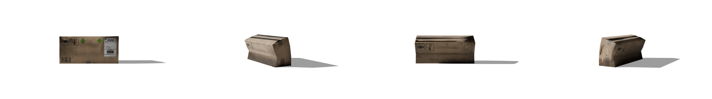
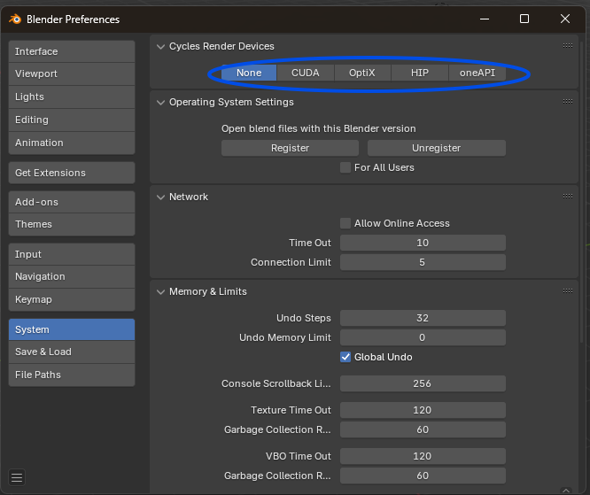

# 3D to 2D Image Generator



## 📝 Description

A Blender-based tool that converts 3D models into transparent PNG images for computer vision applications. 

### ✨ Key Features
- 🎨 Two rendering modes:
  - **Hardbody**: Static object rendering with precise control
  - **Softbody**: Physics-based simulation with dynamic deformations and randomized results

### 🔄 Workflow
1. Import 3D model into Blender
2. Automatic model cleanup and optimization
3. Generate multiple viewpoints by rotating the object
4. Export as high-resolution transparent PNGs

### ⚙️ Technical Capabilities
- **Camera Setup**: Fixed camera position with object rotation for consistent lighting
- **Customization**: Adjustable parameters for:
  - Object position and rotation
  - Mesh optimization & correction (decimation, vertex merging)
  - Rendering quality and resolution
- **Output**: High-quality PNG files with alpha channel support

### 🎯 Purpose

This tool streamlines the creation of transparent object images for computer vision applications by:

- 🤖 Training AI Models: Generate synthetic datasets for machine learning
- 📊 Dataset Creation: Produce consistent, high-quality object views from multiple angles
- 🔄 Scene Integration: Create images that can be easily composited into different backgrounds

## Scripts

### Renderers

- **Hardbody Renderer** (`Renderer hardbody/`): A precision-focused renderer for generating high-quality 2D renders of 3D models with deterministic output. [Learn more](Renderer%20hardbody/Readme.md)

- **Softbody Renderer** (`Renderer softbody/`): A physics-based renderer that creates dynamic 2D renders with realistic deformations and cloth simulations. [Learn more](Renderer%20softbody/Readme.md)

### Utilities

- **Image Collection Creator**: Collects images from nested folders into a single output folder
- **Automatic Image Cropper**: Crops images to remove transparent padding
- **Compositor**: Creates grid composites of rendered images
- **Crop and Collect Runner**: Combines collection and cropping in one step

[View all utilities documentation](Utilities/README.md)

## 💻 Installation and usage
    
### 🪟 Blender (Windows)
Download and install Blender from the [official website](https://www.blender.org/download/).

No additional python or installation is needed, the scripts are ment to be run from the 'scripts' tab in Blender.


#### 🐳 Deploy Blender with Docker using GPU (Linux Server)


1. Launch the container:
    ```
    docker run -d \
    --name=blender \
    --security-opt seccomp=unconfined \
    --runtime=nvidia \
    -e NVIDIA_VISIBLE_DEVICES=0 \
    -e PUID=1007 \
    -e PGID=1008 \
    -e TZ=Etc/UTC \
    -p 3000:3000 \
    -v /local/path:/path/in/container \
    --restart unless-stopped \
    linuxserver/blender:latest
    ```

📋 Notes:

### GPU Configuration
To enable GPU acceleration in Blender:
1. Open Blender
2. Go to Edit > Preferences > System
3. Under "Cycles Render Devices", select your GPU



### Docker User Authentication
If you're running Blender in Docker on Linux and encounter crashes due to user authentication:
1. Wait for the Docker container to be ready
2. Execute Blender using the container's default user 'abc':
   ```bash
   docker exec -it --user abc blender blender
   ```

### Additional Docker Settings
- `NVIDIA_VISIBLE_DEVICES=0` specifies GPU 0 for use. Change the number to use a different GPU
- Adjust `PUID` and `PGID` to match your Docker user's ID

2. Connect from your local machine:
Create an SSH tunnel:
    ```
    ssh -L 3000:localhost:3000 user@server-IP
    ```

3. Open Blender Web:
- In your browser, go to:
    ```
    http://localhost:3000
    ```

### 📦 Assets

To use these scripts, you will need 3D models of the objects you want to render.

#### 🧩 3D Assets Requirements

- **Format:** Models must be in the **GLB** format.
- **Source:** You can find suitable 3D models on [Sketchfab](https://sketchfab.com/3d-models), make sure to check their license.
- ⚠️**Single Object:** Each model should consist of a single object. If your model is made up of multiple objects, you will need to manually join them into one before using the scripts.

### ▶️ Running the scripts

1. Open Blender and navigate to the 'scripting' tab.
2. Click on the open file button and navigate to the script you want to run.
3. Configure the parameters of the script to your needs.  
    - See each script page for more information on each parameter.
4. Click on the 'Run Script' button.

⚠️ **Important**  
During the rendering process, Blender may appear frozen. This is normal behavior - the application will resume once all views have been rendered and saved to the output folder.
