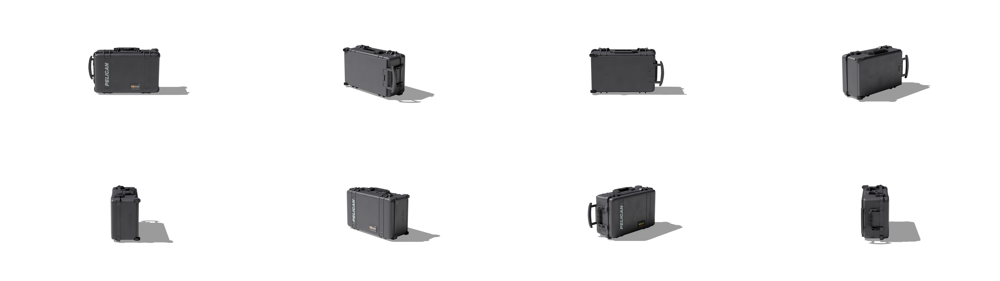

# Hardbody Renderer




## 📝 Description

A precision-focused Blender script for generating high-quality 2D renders of 3D models with deterministic output. This renderer specializes in creating multiple standardized views of static objects with consistent lighting, camera angles, and ground alignment.

## ✨ Key Features

- **Automatic Object Processing**
  - Precise object centering and ground alignment
  - Smart vertex analysis to properly position objects on the ground plane
  - Origin setting to center of mass for consistent rotation
  - Optional mesh optimization with adjustable parameters

- **Multi-perspective Rendering**
  - 4 major orientation views (0°, 90°X, -90°X, 90°Y rotations)
  - 6 rotation angles per orientation (0°, 60°, 120°, 180°, 240°, 300°)
  - Total of 24 unique perspective renders per object
  - Customizable rotation increments and sequences

- **Professional Render Setup**
  - Cycles render engine with CUDA GPU acceleration
  - Transparent background with shadow catcher
  - Camera and light tracking constraints
  - Contrast and saturation enhancements via compositor nodes
  - Optional random material colors for dataset generation

## 🛠️ Technical Implementation

The script provides a complete rendering pipeline including:

1. **Scene Setup**
   - Clears existing scene objects
   - Sets up camera at (0, -2.6, 0.5) with proper rotation
   - Creates sun light at (-3, 0, 2) with object tracking
   - Implements shadow catcher with 0.7 opacity

2. **Object Processing**
   - Imports GLB file and sets as active object
   - Finds second-lowest vertex for proper ground alignment
   - Sets object origin to center of mass
   - Centers object at (0,0,0) coordinates
   - Optional mesh optimization by removing duplicate vertices

3. **Material Handling**
   - Optional random color generation for object materials
   - Node-based material processing
   - Preserves original material structure

4. **Output Management**
   - Organized folder structure by object and orientation
   - Consistent naming convention for renders
   - Transparent PNG output format

## ⚙️ Configuration Options

The script uses a comprehensive configuration dictionary that allows you to customize various aspects of the rendering process:

```python
config = {
    # Processing mode
    'mode': 'directory',  # 'single' or 'directory'
    
    # Input/Output paths
    'single_model_path': "path/to/your/model.glb",
    'models_directory': "path/to/models/folder",
    'output_directory': "path/to/output/folder",
    
    # Render settings
    'render_engine': 'CYCLES',  # 'CYCLES' or 'EEVEE'
    'gpu_acceleration': True,
    'compute_device': 'CUDA',  # 'CUDA', 'OPTIX', or 'OPENCL'
    'samples': 128,  # Higher values = better quality but slower
    'resolution_x': 1920,
    'resolution_y': 1080,
    'resolution_percentage': 100,
    'file_format': 'PNG',  # 'PNG', 'JPEG', 'TIFF', etc.
    'transparent_background': True,
    
    # Post-processing
    'contrast': 1.05,  # Values > 1 increase contrast
    'saturation': 1.3,  # Values > 1 increase saturation
    
    # Camera settings
    'camera_location': (0, -2.6, 0.5),  # (x, y, z)
    'camera_rotation': (math.pi/2, 0, 0),  # (x, y, z) in radians
    'track_object': True,  # Whether camera should track the object
    'auto_frame_object': False,  # Enable to automatically frame the object
    'frame_coverage': 0.7,  # How much of the frame the object should fill (0.0 to 1.0)
    
    # Light settings
    'light_type': 'SUN',  # 'SUN', 'POINT', 'SPOT', 'AREA'
    'light_location': (-3, 0, 2),  # (x, y, z)
    'light_energy': 1.0,  # Light strength
    
    # Shadow catcher
    'shadow_catcher_location': (0, 0, 0),  # (x, y, z)
    'shadow_catcher_size': 20,  # Size of the shadow catcher plane
    'shadow_opacity': 0.7,  # Shadow opacity (0.0 to 1.0)
    
    # Mesh optimization
    'optimize_mesh': False,  # Enable mesh optimization by removing duplicate vertices
    'remove_doubles_threshold': 0.01,  # Distance threshold for considering vertices as duplicates
    
    # Material settings
    'random_colors': False,  # Set to True to apply random colors to materials
    
    # Rotation settings
    'rotation_increments': 60,  # Angle increments for each rotation step (in degrees)
    'rotations': [  # Base rotations for different orientations (in degrees)
        (0, 0, 0),      # Default orientation
        (90, 0, 0),     # X-axis rotation
        (-90, 0, 0),    # Negative X-axis rotation
        (0, 90, 0),     # Y-axis rotation
        # Add or remove rotations as needed
    ]
}
```

### Configuration Details

#### Processing Mode
- `mode`: Choose between 'single' (process one model) or 'directory' (process all .glb files in a directory)

#### Render Settings
- `render_engine`: Blender rendering engine to use ('CYCLES' or 'EEVEE')
- `gpu_acceleration`: Whether to use GPU for rendering
- `compute_device`: GPU compute device type ('CUDA', 'OPTIX', or 'OPENCL')
- `samples`: Number of render samples (higher values = better quality but slower)
- `resolution_x`, `resolution_y`: Output resolution in pixels
- `resolution_percentage`: Resolution scale factor (100 = full resolution)
- `file_format`: Output image format ('PNG', 'JPEG', 'TIFF', etc.)
- `transparent_background`: Whether to render with transparent background

#### Post-processing
- `contrast`: Contrast adjustment (values > 1 increase contrast)
- `saturation`: Saturation adjustment (values > 1 increase saturation)

#### Camera and Light
- `camera_location`: 3D position of the camera
- `camera_rotation`: Camera rotation in radians
- `track_object`: Whether camera should automatically track the object
- `auto_frame_object`: Enable to automatically frame the object
- `frame_coverage`: How much of the frame the object should fill (0.0 to 1.0)
- `light_type`: Type of light ('SUN', 'POINT', 'SPOT', 'AREA')
- `light_location`: 3D position of the light
- `light_energy`: Light intensity/strength

#### Mesh Optimization
- `optimize_mesh`: Enable/disable mesh optimization
- `remove_doubles_threshold`: Distance threshold for merging vertices (higher values merge more vertices)

#### Material Settings
- `random_colors`: Enable/disable random material colors (useful for dataset generation)

#### Rotation Settings
- `rotation_increments`: Angle increments for each rotation step (in degrees)
- `rotations`: List of base rotations for different orientations

## 📁 Output Structure

```
output_dir/
    ├── [model_name]/
        ├── 0/          # Default orientation (0°,0°,0°)
        │   ├── render_0.png
        │   ├── render_60.png
        │   └── ... (6 rotations)
        ├── 1/          # X-axis rotation (90°,0°,0°)
        │   ├── render_0.png
        │   └── ... (6 rotations)
        ├── 2/          # X-axis rotation (-90°,0°,0°)
        │   ├── render_0.png
        │   └── ... (6 rotations)
        └── 3/          # Y-axis rotation (0°,90°,0°)
            ├── render_0.png
            └── ... (6 rotations)
```

## 🚀 Usage

### Script Configuration

Edit the configuration dictionary at the bottom of the script:

```python
config = {
    'mode': 'single',  # or 'directory'
    'single_model_path': "path/to/your/model.glb",
    'models_directory': "path/to/models/folder",
    'output_directory': "path/to/output/folder",
    # ... other settings as needed
}
```

### Running in Blender

1. Open Blender and switch to the Scripting workspace
2. Open `renderer_hard.py` in the text editor
3. Update the configuration dictionary at the bottom of the script
4. Click "Run Script" button or press Alt+P

## ⚠️ Important Notes

- **GPU Acceleration**: The script is configured for NVIDIA GPUs with CUDA. For other GPUs, modify the `compute_device` parameter
- **Object Requirements**: Models should be single objects; for multi-part models, join them before processing
- **Ground Alignment**: The script uses the second-lowest vertex to align objects to the ground plane, which works well for most models
- **Processing Time**: Rendering 24 perspectives per object is resource-intensive; expect several minutes per model depending on complexity
- **Memory Usage**: For large batch processing, monitor system memory usage
- **Mesh Optimization**: If models have topology issues, enable `optimize_mesh` to clean up duplicate vertices
- **Random Colors**: For dataset generation with varied appearances, enable `random_colors`, each run will have the object colored differently

## 🧩 Advanced Customization

### Multiple Material Variations

To generate multiple variations of the same model with different random colors:

1. Set `random_colors: True` in your configuration
2. Process the same model multiple times with different random seeds

### Mesh Optimization

For models with topology issues or unnecessary complexity:

1. Enable mesh optimization: `optimize_mesh: True`
2. Adjust the threshold: `remove_doubles_threshold: 0.01` (higher values merge more vertices)

    ### ⚠️

    **Start with low threshold values (0.001-0.01)** and test on a single model first. Higher values may:
    - Fix mesh holes but reduce detail
    - Create visual artifacts
    - Distort geometry

