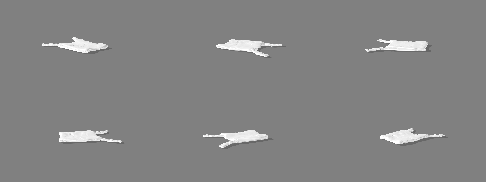

# Softbody Renderer




## 📝 Description

A physics-based Blender script for generating dynamic 2D renders of 3D models with realistic deformations. This renderer specializes in creating varied, organic-looking views of objects by simulating cloth and softbody physics, producing unique results with each run.

## ✨ Key Features

- **Physics-Based Deformation**
  - Cloth simulation with customizable material properties (leather, plastic)
  - Realistic gravity and collision effects
  - Randomized simulation parameters for varied results
  - Multiple simulation runs per object for dataset generation

- **Automatic Object Processing**
  - Smart mesh preparation with decimation to target face count
  - Boundary vertex handling and optimization
  - Automatic ground alignment and centering

- **Professional Render Setup**
  - Cycles render engine with CUDA GPU acceleration
  - Transparent background with shadow catcher
  - Camera and light tracking for consistent framing
  - Optional color randomization for material variations

## 🛠️ Technical Implementation

The script provides a complete physics-based rendering pipeline:

1. **Mesh Preparation**
   - Automatic decimation to manageable polygon count
   - Removal of double vertices and optimization
   - Optional shape key removal
   - Conversion to quads for better simulation behavior

2. **Physics Simulation**
   - Material-specific physics parameters (leather or plastic)
   - Randomized internal spring constraints
   - Self-collision detection and handling
   - Multi-frame animation with automatic baking

3. **Render Processing**
   - Simulated mesh is applied as the final shape
   - Multiple camera angles capture all sides
   - Optional post-processing for contrast and saturation
   - Transparent background with subtle shadows

## ⚙️ Configuration Options

The script uses a comprehensive configuration dictionary that allows you to customize various aspects of the rendering and simulation process:

```python
config = {
    # Processing mode
    'mode': 'directory',  # 'single' or 'directory'
    
    # Input/Output paths
    'single_model_path': "path/to/your/model.glb",
    'models_directory': "path/to/models/folder",
    'output_directory': "path/to/output/folder",
    
    # Number of variations per model
    'runs_per_object': 5,
    
    # Render settings
    'render_engine': 'CYCLES',
    'gpu_acceleration': True,
    'compute_device': 'CUDA',
    'samples': 128,
    'resolution_x': 1920,
    'resolution_y': 1080,
    'resolution_percentage': 100,
    'file_format': 'PNG',
    'transparent_background': True,
    
    # Post-processing
    'use_compositor': True,
    'contrast': 1.05,
    'saturation': 1.3,
    
    # Camera settings
    'camera_location': (0, -2, 0.5),
    'camera_rotation': (math.pi/2, 0, 0),
    'track_object': True,
    
    # Light settings
    'light_type': 'SUN',
    'light_location': (-3, 0, 2),
    'light_energy': 1.0,
    
    # Shadow catcher
    'shadow_catcher_location': (0, 0, 0),
    'shadow_catcher_size': 20,
    'shadow_opacity': 0.6,
    
    # Mesh optimization
    'optimize_mesh': False,
    'remove_doubles_threshold': 0.001,
    'decimate_target': 10000,
    
    # Material settings
    'random_colors': True,
    
    # Rotation settings
    'rotation_increments': 60,
    
    # Simulation settings
    'simulation_type': 'Cloth',  # 'Cloth' or 'Softbody'
    'simulation_material': 'leather',  # 'leather' or 'plastic'
    'simulation_min_duration': 0.5,
    'simulation_max_duration': 8.0,
    'save_parameters': True,
    'object_elevation': 0.2,  # Initial Z height for the object
    'object_final_elevation': 0.02  # Final Z height after simulation
}
```

### Configuration Details

#### Physics Simulation
- `simulation_type`: Choose between 'Cloth' (more dynamic folds) and 'Softbody' (more volumetric deformation)
- `simulation_material`: Material preset to use ('leather' or 'plastic')
- `simulation_min_duration`, `simulation_max_duration`: Range of simulation time in seconds
- `object_elevation`: Initial height above ground for the object (affects drop impact)
- `object_final_elevation`: Final height after simulation (for consistent rendering)

#### Processing and Output
- `mode`: Choose between 'single' (process one model) or 'directory' (process all .glb files in a directory)
- `runs_per_object`: Number of different simulation variations to generate per model
- `decimate_target`: Target face count for mesh decimation before simulation
- `save_parameters`: Whether to save the randomized simulation parameters to a text file

#### Render Settings
- `render_engine`: Blender rendering engine to use ('CYCLES' recommended for physics)
- `gpu_acceleration`: Whether to use GPU for rendering
- `compute_device`: GPU compute device type ('CUDA', 'OPTIX', or 'OPENCL')
- `samples`: Number of render samples (higher values = better quality but slower)
- `resolution_x`, `resolution_y`: Output resolution in pixels
- `resolution_percentage`: Resolution scale factor (100 = full resolution)

## 📁 Output Structure

```
output_directory/
    ├── [model_name]/                    # Base directory for each model
    │   ├── _run_0/                      # First simulation run
    │   │   ├── render_0.png             # Render at 0 degrees
    │   │   ├── render_60.png            # Render at 60 degrees
    │   │   ├── render_120.png           # Render at 120 degrees
    │   │   ├── render_180.png           # Render at 180 degrees
    │   │   ├── render_240.png           # Render at 240 degrees
    │   │   ├── render_300.png           # Render at 300 degrees
    │   │   └── sim_params.txt           # Simulation parameters used
    │   │
    │   ├── _run_1/                      # Second simulation run
    │   │   ├── render_0.png
    │   │   └── ... (additional rotations)
    │   │
    │   └── ... (additional runs)        # More runs based on runs_per_object
    │
    └── [another_model_name]/            # Directory for another model
        └── ... (same structure as above)
```

Each model gets its own directory named after the input GLB file (without extension). Within each model directory:
- Multiple run directories (`_run_0`, `_run_1`, etc.) are created based on `runs_per_object` setting
- Each run directory contains:
  - Rendered images at different angles (incrementing by `rotation_increments` degrees)
  - A `sim_params.txt` file containing the randomized simulation parameters used for that run
- The number of rendered images depends on the `rotation_increments` setting (default: 60 degrees = 6 images per run)

## 🚀 Usage

### Script Configuration

Edit the configuration dictionary at the bottom of the script:

```python
config = {
    'mode': 'directory',
    'models_directory': "path/to/models/folder",
    'output_directory': "path/to/output/folder",
    'runs_per_object': 5,
    # ... other settings as needed
}
```

### Running in Blender

1. Open Blender and switch to the Scripting workspace
2. Open `renderer_soft.py` in the text editor
3. Update the configuration dictionary at the bottom of the script
4. Click "Run Script" button or press Alt+P

## ⚠️ Important Notes

- **Physics Simulation**: The quality of results depends on the model's topology and complexity
- **Decimation**: Models with very high poly counts are automatically decimated to improve simulation performance
- **Memory Usage**: Physics simulations can be memory-intensive; monitor system resources
- **Simulation Time**: Each run may take several minutes depending on complexity and simulation duration
- **Failed Simulations**: Some models may produce unpredictable physics results; experiment with different settings

## 🧩 Advanced Customization

### Material-Specific Physics

The script includes two material presets:

1. **Leather** 
   - Higher internal tension values (64-96)
   - Higher bending stiffness (120-180)
   - Good for fabric-like, folding behavior

2. **Plastic**
   - Lower mass (0.05-0.3)
   - Volume preservation with internal pressure
   - Better for balloon-like or inflated objects

For other materials, you can create custom presets by modifying the `setup_simulation_env_cloth` function.

### Multiple Simulation Variations

To generate multiple variations of the same model:

1. Set `runs_per_object` to the desired number of variations (default: 5)
2. Each run will use different random simulation parameters
3. Optional: Set a specific seed value for reproducible results
